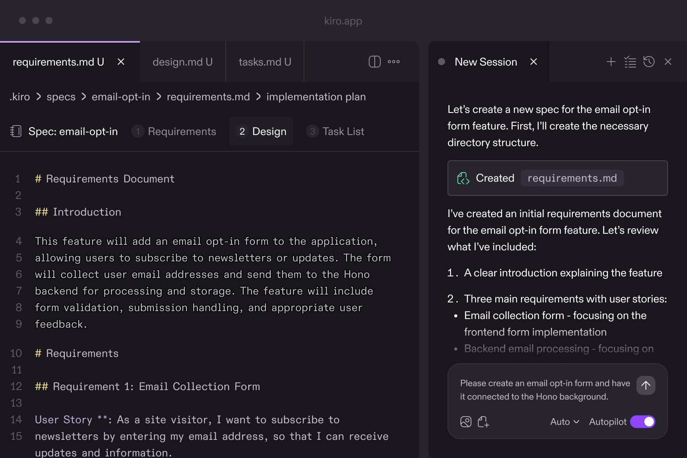

https://kiro.dev/

* Kiro
  * := Agentic AI development platform /
    * 💡[spec-driven development](docs_specs_.md)💡
      * == [Natural prompt](docs_chat_.md) -- to -- [structured requirements](docs_specs_concepts_.md)
        * requirements | EARS notation

        

    * [advanced steering](docs_steering_.md)
    * custom agents
    * FROM prototype -- to -- production
      * 

* [Youtube video](https://www.youtube.com/watch?v=JOqLp1adGO4&t=1s)
  * TODO: 
* 

* 
  * Architectural designs backed by best practicesOnce you’ve iterated on requirements, Kiro analyzes your codebase and comes up with the architecture, system design, and tech stack that meets your needs.Loading image...Discrete tasks that map to requirementsKiro then creates an implementation plan with discreet tasks, sequenced based on dependencies, with optional comprehensive tests
* Ask Kiro to implement each task using advanced agents, and watch the magic happen.Conversation to code to deployment, directly from the terminalAccess Kiro agents in your favorite terminal
* Build features, automate workflows in seconds, analyze errors, trace bugs, and suggest fixes locally or over SSH—all in a terminal of your choice, in a highly interactive loop that keeps you in flow.Learn more about CLIInstall on macOS and Linuxcurl -fsSL https://cli.kiro.dev/install | bashLoading image...Terminal — 80×24Automate tasks with agent hooksDelegate tasks to AI agents that trigger on events such as file save
* Agents autonomously execute in the background based on your pre-defined prompts, helping you scale your work by generating documentation, unit tests, or optimizing code performance.Learn more about hooksLoading image...{EVERYTHING YOU NEED}Go from vibe coding to viable codeBuilt for working with agentsMultimodal chat, spec-driven development, agent hooks - Kiro gives you the best tool for the job in a fresh development experience that still feels familiar.Advanced context managementWith specs, steering, and smart context management, Kiro understands the intent behind your prompts and helps you implement complex features on larger codebases, in fewer shots.Native MCP supportConnect to docs, databases, APIs, and more with native MCP integration, including remote, so you can bring your world where you work.Your code, your rulesConfigure how you want Kiro agents to interact with each project, or globally, via steering files
* Add context, coding standards, preferred workflows or tools with a simple command.Powered by the state of the artChoose between Claude Sonnet 4.5 for reliable advanced coding and reasoning, or Auto, which uses a mix of frontier models (like Sonnet 4.5 and other specialized models) for intent detection and caching to balance quality, latency, and cost.Compatible with VS CodeKiro supports Open VSX plugins, themes, and VS Code settings in a streamlined AI-ready environment.Strap in with autopilot modeLet Kiro autonomously run large tasks on its own without needing step-by-step instructions
* You stay in control, especially when running scripts or commands.Per prompt credit usageSee how many credits each prompt consumes, in real-time, so you're always in control of your spend.Show, don’t tellDrop an image of your UI design or a photo of your architecture whiteboarding session, and Kiro can use it to guide its implementation.Generate Git commit messagesDraft commit messages using the agent directly from the source control pane with a single click.Intelligent error diagnosticsKiro can read and interpret syntax, type, and semantic errors, making it easier to iterate and fix bugs.Witness the magic with code diffsSee code changes as they happen
* Approve everything, step through each change, or make edits with one click.With enterprise-grade security and privacy, you can ship your best work with confidence.Learn moreTrusted by engineers worldwideAs a startup co-founder and CTO, time is the most important resource
* Kiro justifies the use of my time for developing our business critical assets in-house.RORolf KoskiCTO & Co-FounderIn my role designing AWS Cloud and AI solutions with Terraform and Python, spec-driven development with Kiro has brought code relevancy and quality to a whole new level
* We’ve accelerated feature development dramatically, reducing time to customer value from weeks to days
* We are excited to welcome Kiro as our newest team member.HÃ
Håkon Eriksen DrangePrincipal Cloud ArchitectKiro’s autonomous agents were game-changers
* Every time we saved a file, agents would automatically generate unit tests, optimize performance, and update documentation
* What used to take hours of manual work happened instantly in the background.KIKiran RavichandranLead EngineerKiro is a strong ally for startups
* It naturally turns overlooked docs and specs into robust assets, making growth smoother and future scaling more effective.KEKento IkedaFounder & EngineerI use Kiro for everything - drafting new Terraform modules, tweaking container setups, even writing down random AI ideas at 2 am
* But more than anything, it supports how I learn
* I’m endlessly curious, and Kiro helps me stay in that learning loop—tinkering, breaking things, fixing them, and then allowing me to share what I learn back with the community.ADAdit ModiSolution ArchitectI’ve been blown away by Kiro’s capabilities
* The agentic experience is really transformative
* From the multimodal inputs that understand context to the complete lifecycle control within the IDE, it feels like I’m working with a senior developer.VIVivek VelsoCloud Engineering LeadMost tools are great at generating code, but Kiro gives structure to the chaos before you write a single line.FAFarah AbdirahmanCloud & AI EngineerIn roughly two days, I built a secure file sharing application from scratch
* By simply sharing my requirements with Kiro, I was able to create a fully secure application that incorporates encryption and various security coding practices—no additional prompts needed.IHIhor SasovetsLead Security EngineerI often forget to add unit tests, or update documentation when pushing changes, but with Kiro I can create a hook and it will automatically run those tasks in the background for me, never having to think twice.DADarya PetrashkaSenior Data ScientistAs an open source developer, I typically don’t build games, but last night I was able to create one using Kiro
* I didn’t have to think too hard about implementation since Kiro handled the logic and enabled me to write code quickly and accurately.MIMichael WalmsleyServerless Application ArchitectKiro lowers the barrier to entry, whether that be, you don’t even know how to code, you’re new to coding, or you’re like me and you’re just learning a new tech stack
* If something doesn’t make sense to you, or you feel like you are asking a silly question, ask Kiro anyway!DADanielle HeberlingFounding Infrastructure EngineerKiro comes equipped with all the best practices that I would put in my specs, and builds me the application I want, faster.BLBlake RomanoSenior Software EngineerThanks to Kiro’s spec-driven development, I was able to go from concept to working prototype in a single weekend.DADakota LewallenSoftware EngineerIn just four lines into a spec, Kiro was able to write user stories like a product manager and capture so many details that I didn’t even need to mention, saving me several days of work.SASathiesh VeeraPrincipal Software EngineerKiro isn’t just speeding up my work – it’s making me write better code, think more systematically about architecture, and deliver higher quality results while automated workflows happen seamlessly in the background.ANAnuj TyagiDeveloperKiro is just more than code
* Aside from just listening to prompts and doing things, it can actually work on tasks based on predefined triggers, making the development experience more efficient.SRSreekesh IyerSoftware EngineerAs a startup co-founder and CTO, time is the most important resource
* Kiro justifies the use of my time for developing our business critical assets in-house.RORolf KoskiCTO & Co-FounderIn my role designing AWS Cloud and AI solutions with Terraform and Python, spec-driven development with Kiro has brought code relevancy and quality to a whole new level
* We’ve accelerated feature development dramatically, reducing time to customer value from weeks to days
* We are excited to welcome Kiro as our newest team member.HÃ
Håkon Eriksen DrangePrincipal Cloud ArchitectKiro’s autonomous agents were game-changers
* Every time we saved a file, agents would automatically generate unit tests, optimize performance, and update documentation
* What used to take hours of manual work happened instantly in the background.KIKiran RavichandranLead EngineerKiro is a strong ally for startups
* It naturally turns overlooked docs and specs into robust assets, making growth smoother and future scaling more effective.KEKento IkedaFounder & EngineerI use Kiro for everything - drafting new Terraform modules, tweaking container setups, even writing down random AI ideas at 2 am
* But more than anything, it supports how I learn
* I’m endlessly curious, and Kiro helps me stay in that learning loop—tinkering, breaking things, fixing them, and then allowing me to share what I learn back with the community.ADAdit ModiSolution ArchitectI’ve been blown away by Kiro’s capabilities
* The agentic experience is really transformative
* From the multimodal inputs that understand context to the complete lifecycle control within the IDE, it feels like I’m working with a senior developer.VIVivek VelsoCloud Engineering LeadMost tools are great at generating code, but Kiro gives structure to the chaos before you write a single line.FAFarah AbdirahmanCloud & AI EngineerIn roughly two days, I built a secure file sharing application from scratch
* By simply sharing my requirements with Kiro, I was able to create a fully secure application that incorporates encryption and various security coding practices—no additional prompts needed.IHIhor SasovetsLead Security EngineerI often forget to add unit tests, or update documentation when pushing changes, but with Kiro I can create a hook and it will automatically run those tasks in the background for me, never having to think twice.DADarya PetrashkaSenior Data ScientistAs an open source developer, I typically don’t build games, but last night I was able to create one using Kiro
* I didn’t have to think too hard about implementation since Kiro handled the logic and enabled me to write code quickly and accurately.MIMichael WalmsleyServerless Application ArchitectKiro lowers the barrier to entry, whether that be, you don’t even know how to code, you’re new to coding, or you’re like me and you’re just learning a new tech stack
* If something doesn’t make sense to you, or you feel like you are asking a silly question, ask Kiro anyway!DADanielle HeberlingFounding Infrastructure EngineerKiro comes equipped with all the best practices that I would put in my specs, and builds me the application I want, faster.BLBlake RomanoSenior Software EngineerThanks to Kiro’s spec-driven development, I was able to go from concept to working prototype in a single weekend.DADakota LewallenSoftware EngineerIn just four lines into a spec, Kiro was able to write user stories like a product manager and capture so many details that I didn’t even need to mention, saving me several days of work.SASathiesh VeeraPrincipal Software EngineerKiro isn’t just speeding up my work – it’s making me write better code, think more systematically about architecture, and deliver higher quality results while automated workflows happen seamlessly in the background.ANAnuj TyagiDeveloperKiro is just more than code
* Aside from just listening to prompts and doing things, it can actually work on tasks based on predefined triggers, making the development experience more efficient.SRSreekesh IyerSoftware EngineerAs a startup co-founder and CTO, time is the most important resource
* Kiro justifies the use of my time for developing our business critical assets in-house.RORolf KoskiCTO & Co-FounderIn my role designing AWS Cloud and AI solutions with Terraform and Python, spec-driven development with Kiro has brought code relevancy and quality to a whole new level
* We’ve accelerated feature development dramatically, reducing time to customer value from weeks to days
* We are excited to welcome Kiro as our newest team member.HÃ
Håkon Eriksen DrangePrincipal Cloud ArchitectKiro’s autonomous agents were game-changers
* Every time we saved a file, agents would automatically generate unit tests, optimize performance, and update documentation
* What used to take hours of manual work happened instantly in the background.KIKiran RavichandranLead EngineerKiro is a strong ally for startups
* It naturally turns overlooked docs and specs into robust assets, making growth smoother and future scaling more effective.KEKento IkedaFounder & EngineerI use Kiro for everything - drafting new Terraform modules, tweaking container setups, even writing down random AI ideas at 2 am
* But more than anything, it supports how I learn
* I’m endlessly curious, and Kiro helps me stay in that learning loop—tinkering, breaking things, fixing them, and then allowing me to share what I learn back with the community.ADAdit ModiSolution ArchitectI’ve been blown away by Kiro’s capabilities
* The agentic experience is really transformative
* From the multimodal inputs that understand context to the complete lifecycle control within the IDE, it feels like I’m working with a senior developer.VIVivek VelsoCloud Engineering LeadMost tools are great at generating code, but Kiro gives structure to the chaos before you write a single line.FAFarah AbdirahmanCloud & AI EngineerIn roughly two days, I built a secure file sharing application from scratch
* By simply sharing my requirements with Kiro, I was able to create a fully secure application that incorporates encryption and various security coding practices—no additional prompts needed.IHIhor SasovetsLead Security EngineerI often forget to add unit tests, or update documentation when pushing changes, but with Kiro I can create a hook and it will automatically run those tasks in the background for me, never having to think twice.DADarya PetrashkaSenior Data ScientistAs an open source developer, I typically don’t build games, but last night I was able to create one using Kiro
* I didn’t have to think too hard about implementation since Kiro handled the logic and enabled me to write code quickly and accurately.MIMichael WalmsleyServerless Application ArchitectKiro lowers the barrier to entry, whether that be, you don’t even know how to code, you’re new to coding, or you’re like me and you’re just learning a new tech stack
* If something doesn’t make sense to you, or you feel like you are asking a silly question, ask Kiro anyway!DADanielle HeberlingFounding Infrastructure EngineerKiro comes equipped with all the best practices that I would put in my specs, and builds me the application I want, faster.BLBlake RomanoSenior Software EngineerThanks to Kiro’s spec-driven development, I was able to go from concept to working prototype in a single weekend.DADakota LewallenSoftware EngineerIn just four lines into a spec, Kiro was able to write user stories like a product manager and capture so many details that I didn’t even need to mention, saving me several days of work.SASathiesh VeeraPrincipal Software EngineerKiro isn’t just speeding up my work – it’s making me write better code, think more systematically about architecture, and deliver higher quality results while automated workflows happen seamlessly in the background.ANAnuj TyagiDeveloperKiro is just more than code
* Aside from just listening to prompts and doing things, it can actually work on tasks based on predefined triggers, making the development experience more efficient.SRSreekesh IyerSoftware EngineerGet started fast with quick guidesLoading image...Learn by playing: create a video gameIn this guide, you will learn how to use Kiro by completing tasks in the codebase for a sample video game called Spirit of Kiro.{Hackathon}Create something spooky by Dec
* 5th for Kiroween{Guide}Your first projectCommon questionsWhat is Kiro?What is Kiro?Kiro is an agentic AI with an [IDE](/docs/) and [CLI](/docs/cli/) that helps you go from prototype to production with spec-driven development
* From simple to complex tasks, Kiro works alongside you to turn prompts into detailed specs, then into working code, docs, and tests—so what you build is exactly what you want and ready to share with your team
* Kiro’s agents help you solve challenging problems and automate tasks like generating documentation and unit tests
* With Kiro, you can build beyond prototypes while being in the driver’s seat every step of the way.
What is spec-driven development? How is it different from vibe coding?What is spec-driven development? How is it different from vibe coding?Developing with specs keeps the fun of vibe coding, but fixes some of its limitations: vibe coding can require too much guidance on complex tasks or when building on top of large codebases, and it can misinterpret context
* When implementing a task with vibe coding, it’s difficult to keep track of all the decisions that were made along the way, and document them for your team
* By using specs, Kiro works alongside you to define requirements, system design, and tasks to be implemented before writing any code
* This approach explicitly documents the reasoning and implementation decisions, so Kiro can implement more complex tasks in fewer shots.
How can I get started with Kiro?How can I get started with Kiro?Kiro works as a standalone agentic [IDE](/docs/) or [CLI](/docs/cli)
* [Download](/downloads/) the installer for your operating system, and log in with GitHub, Google, AWS Builder ID, or AWS IAM Identity Center
* You do not need an AWS account to use Kiro
* For more, see [documentation](/docs).
What programming languages does Kiro support?What programming languages does Kiro support?Kiro supports a variety of programming languages that developers use in their day to day work
* This list includes, but is not limited to Python, Java, JavaScript, TypeScript, C#, Go, Rust, PHP, Ruby, Kotlin, C, C++, shell scripting, SQL, Scala, JSON, YAML, and HCL.
What languages can I ask questions in?What languages can I ask questions in?Kiro is currently optimized for English language conversations and interactions
* Support for additional languages is coming soon.
Can I import settings from my existing IDE?Can I import settings from my existing IDE?Kiro is based on Code OSS, so you can [import your VS Code settings, themes, and Open VSX compatible plugins](/docs/guides/migrating-from-vscode/) in the Kiro onboarding flow.
Browse all FAQsBuild something real in minutesGet started for freeDownloads
